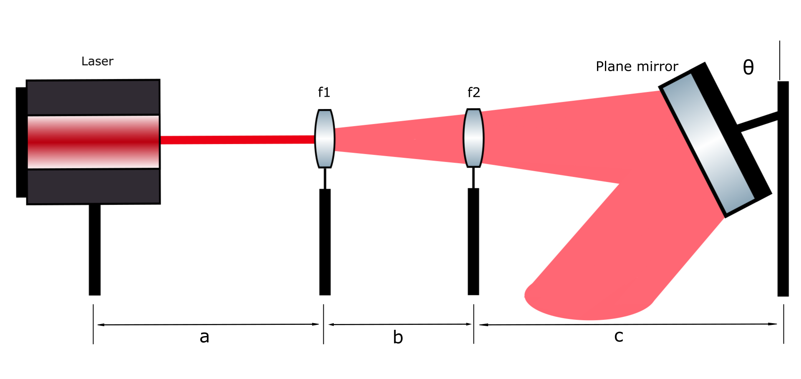

# Estudio del Efecto de Tratamientos Físico-Estimulantes en Fase Pre-Germinativas Aplicados a la Variante Cherry Oregon de *C. sativa*

**Autores:**  
Jorge O. Cedeño¹, Daniel Padilla¹², Jheny Orbe¹²  
¹ Grupo de Investigación y Desarrollo en Ambiente y Cambio Climático (GIDAC-ESPOCH), Riobamba, Ecuador  
² Carrera de Física, Facultad de Ciencias, ESPOCH, Riobamba, Ecuador  

## Introducción

La tendencia en la agricultura es encontrar alternativas que garanticen un incremento significante en el rendimiento de los cultivos además de la disminución del uso de plagicidas,
fertilizantes y reguladores de crecimiento que significa un elevado riesgo de contaminación del medio ambiente [1][6]. Los cambios antropogénicos de la atmósfera, el agua y el suelo 
debido al uso de los diferentes aditivos químicos para aumentar la productividad de las plantas nos llevan a buscar caminos alternativos que cumplan con los requerimientos de preservación 
del medio ambiente [2].  Por ende, la aplicación controlada de los factores físicos como la radiación no ionizante en el comportamiento biológico durante el desarrollo de las plantas es de
sumo interés ecológico [4]. Adicionalmente, las técnicas aplicadas a los cultivos de Cannabis sativa L. para mejorar su rendimiento comercial y medicinal en la industria se basa en radiación
ionizante [3], , sin embargo estos procesos son costosos, por lo que aplicar soluciones con otro tipo de fuentes labra el camino hacia la generación de investigación vanguardista en Ecuador.
Así, los objetivos de esta investigación se centran en evaluar el efecto de tratamientos bioestimulantes de irradiación no ionizante con fuente He-Ne en la emergencia y desarrollo de cultivos 
de Cannabis sativa L. mediante la caracterización de propiedades morfológicas.

## Metodología 

> Calibración del Láser

> Aplicación de los tratamientos de irradiación

Para esta investigación preliminar se utilizó una cantidad total 60 semillas de la variedad Cherry Oregon de Cannabis sativa L, a las cuales a 45 de ellas se les aplicó nueve tratamientos centrados en variar el tiempo de exposición (10, 15 y 20 minutos) y las aplicaciones del tratamiento (1, 2 y 3 días) utilizando una fuente de fotones de longitud de onda monocromática (633 nm) provenientes de un láser He-Ne calibrado a una potencia entre 29 - 32 \mu W. En la figura 2 se resume la cantidad de energía brindada a las semillas, llegando a proporcionar desde 18 mJ (10 minutos), 27 mJ (15 minutos) y 39 mJ (20 minutos) por cada aplicación, teniendo hasta una exposición máxima en el último grupo de irradiación de 60 minutos, equivalentes aproximadamente a 117 mJ.

En la figura 3 se muestra el proceso de aplicación de los distintos tratamientos a las semillas en un área de irradiación de 36.3 cm².

## RESULTADOS
    
|  |  |
|-------------------------------------|-------------------------------------|

**Fig. 4** Comparación de la evolución morfológica de los grupos a la tercera semana desde la siembra: a la izquierda una representante del grupo de control, a la derecha una planta que recibió tres aplicaciones del tratamiento.

|  |  |
|-------------------------------------|-------------------------------------|

**Fig. 5** Comparación de la evolución morfológica de los grupos a la quinta semana desde la siembra: a la izquierda una representante del grupo de control, a la derecha una planta que recibió tres aplicaciones del tratamiento.

- Las semillas que recibieron los tratamientos presentan un desarrollo morfológico acelerado.
  
- Al medir los tamaños de las plántulas a la tercera semana (figura 4) con la herramienta ImageJ podemos resaltar como la plántula de control tuvo una altura de 4.799 cm, estando en un estado de desarrollo 1004 según el código decimal [5]; a diferencia de su contraparte que recibió el tratamiento de 20 minutos en tres aplicaciones, llegando a poseer una altura de 9.748 cm y un estado de desarrollo 1006.
  
- A la quinta semana (figura 5) la diferencia se vuelve cada vez más sobresaliente, debido a que la plántula de control llegó a una altura de 11.741 cm y un estado de desarrollo 1006. Por su parte la plántula irradiada tuvo una altura de 23.254 cm y un estado de desarrollo 1012, superando la plántula de control al doble de su tamaño y al doble de hojas verdaderas presentes.

## Discusión 

Esta investigación desarrollada pone a prueba por primera vez el impacto de la aplicación de tratamientos de irradiación láser (He-Ne) a la especie C. sativa. Para dar más claridad a los resultados mostrados se realizó un análisis ANOVA unidireccional para evaluar el impacto de los diferentes tratamientos en comparación con el grupo de control. Los resultados indican que no se encontraron diferencias estadísticamente significativas entre el conjunto de los tratamientos y el grupo de control (p = 0.0567). Dado que el p-valor es mayor al umbral de significancia convencional de p < 0.05, no se puede relacionar la variación morfológica debido a los tratamientos. Sin embargo, al realizar un ANOVA de manera individual por grupos de tratamientos en comparación al grupo de control encontramos que el tratamiento 7 (exposición de 10 minutos y 3 aplicaciones) es estadísticamente significativo con un valor p = 0.021, confirmando que los efectos observados en las mediciones son producto del tratamiento de irradiación láser aplicado.

## Conclusiones

El estudio evaluó el efecto de tratamientos de irradiación láser (He-Ne) sobre el crecimiento de la variante Cherry Oregon de Cannabis sativa. Aunque los resultados mostraron un desarrollo morfológico acelerado en las plantas irradiadas, el análisis estadístico ANOVA solamente encontró diferencias significativas en el tratamiento 7 en comparación con el grupo de control. Esto sugiere que, bajo las condiciones de este experimento, la mayoría de tratamientos no generaron un impacto significativo en el crecimiento de las plantas, sin embargo la estimulación láser de 10 minutos en aplicaciones por 3 días seguidos provocó una aceleración morfológica significativa en la plántula.
